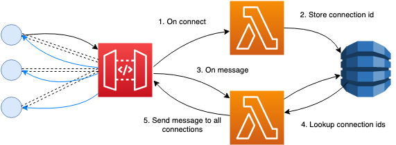

## WebSocket Lambda Workshop

### TL;DR

Install `wscat` (`npm i -g wscat`). Checkout branch `exercise-1`. Have fun!

### Overview

This workshop comprises 3 exercises. Each exercise is available on a separate branch.

By the end of the workshop we'll have deployed a [Lambda](https://aws.amazon.com/lambda/) -powered backend that allows clients to communicate with one another in real-time using [WebSockets](https://en.wikipedia.org/wiki/WebSocket).  

### Target audience

The code samples in the exercise are written in [Typescript](https://www.typescriptlang.org/).

This workshop will make use of but not explain:

 * [AWS API Gateway](https://aws.amazon.com/api-gateway/)
 * [AWS Lambda](https://aws.amazon.com/lambda/)
 * [AWS DynamoDb](https://aws.amazon.com/dynamodb/)
 * [Serverless framework](https://www.serverless.com/)
 
A basic understanding of these technologies is assumed.

### Prerequisites

Before starting this workshop you'll need the following installed:

 * A recent version of [Node](https://nodejs.org/en/) (this workshop was developed and tested with 12.x)
 * [wscat](https://www.npmjs.com/package/wscat) (or another WebSocket client) installed. `npm install -g wscat` will get you up and running
 * [aws cli](https://aws.amazon.com/cli/)
 
We'll be deploying to AWS, so be sure to have an account configured and the bill payer's permission!