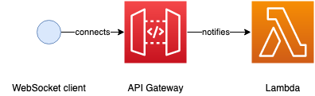

## Exercise 1: Setup a WebSocket connection

In this exercise we'll enable [WebSocket](https://en.wikipedia.org/wiki/WebSocket) clients to establish connections to [API Gateway](https://aws.amazon.com/api-gateway/). On connection a [Lambda](https://aws.amazon.com/lambda/) will be notified.



### Getting up and running

From the terminal run `npm ci` to install project dependencies.

Next create a file called `author.json` in the project root with the following content:

```json
{ "name": "<your-id>" }
```

If you're running this exercise with others, and deploying to the same AWS account, ensure your id is unique to prevent deployed resources from clashing.

Next navigate to our barebones `serverless.yml` file in the project root.

Start by adding a `websocketsApiName` entry to the provider declaration:

```yaml
websocketsApiName: ws-lambda-workshop-api-${file(author.json):name}
```

This simply tells [Serverless](https://www.serverless.com/) that you want API Gateway to provision a [WebSocket API](https://docs.aws.amazon.com/apigateway/latest/developerguide/apigateway-websocket-api.html).

Next add the following Lambda definition under `functions`:

```yaml
onConnect:
    handler: src/connection.onConnect
    events:
        -   websocket: $connect
```

The `events` block indicates that this Lambda will be invoked by a WebSocket event, in this case when a client connects.

The `$connect` label is a [route](https://docs.aws.amazon.com/apigateway/latest/developerguide/websocket-api-develop-routes.html) instruction for API Gateway. There are three predefined routes:
 * `$connect`
 * `$disconnect`
 * `$default`

It's also possible to add your own routing rules.

Our `onConnect` Lambda configuration tells API Gateway that when a WebSocket client connects, the `connection.onConnect` function should be invoked.

Take a look inside `connection.ts` under the `src` folder and you'll see a rudimentary connection handler.

### Ship it! :shipit:

From the terminal run `npx serverless deploy`. Within a couple of minutes you should have a WebSocket API created under API Gateway, and a Lambda deployed to handle connection events.

If you inspect your API with the [aws cli](https://aws.amazon.com/cli/) by running `aws apigatewayv2 get-apis`, the `ProtocolType` should confirm it is indeed a WebSocket API.

### Let's connect!

Using the endpoint printed to the console when you deployed with Serverless, try establishing a WebSocket connection with `wscat`:

```wscat -c wss://<your-api-id>.execute-api.eu-west-1.amazonaws.com/dev```

If everything worked, you should see a message telling you you've connected. Good job! :clap:

If you try to send a message from the WebSocket client you'll receive an error. We'll address that in the next exercise.

Commit or discard your changes, then checkout `exercise-2`.
