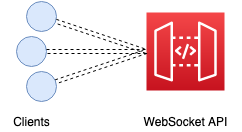

# WebSockets Lambda Workshop

### Exercise 2: Send messages from our Lambda back to the WebSocket client

In this exercise we'll send a message from our Lambda back to the WebSocket client.

#### Identifying the connection

At any given time a WebSocket API could be maintaining multiple open connections.

In order for our Lambda to send a message to the right recipient, we need to tell API Gateway which connection we want it to forward the message on to.

API Gateway makes the unique id for a connection available in the request context whenever a Lambda is triggered by a WebSocket event.

#### Over to you

Take a look at our existing `onConnect` handler. At the moment a client connects, can you send them back a greeting?

There's an `initApiGatewayManagementApi` function that might be useful, these [docs](https://docs.aws.amazon.com/AWSJavaScriptSDK/latest/AWS/ApiGatewayManagementApi.html#postToConnection-property) should also help.

#### Ship it!

Once you're done, try redeploying your Lambda by running `npx serverless deploy`.

This time when you use `wscat` to connect, you should see your welcome message.

Writing to the right connection - that was a rite of passage!
